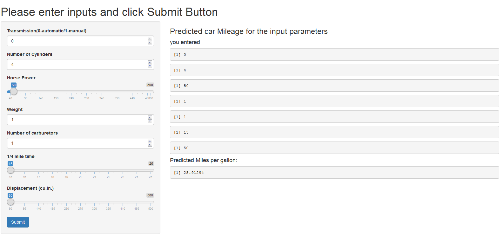

Project Presentation
========================================================
author: Satya Medicherla
date: 
autosize: true
transition : rotate
transition-speed :fast
GitHub URL :  https://github.com/mstayams/DevelopingDataProducts
Application URL :  https://satyams.shinyapps.io/mtcars
Executive Summary 
========================================================

The data was extracted from the 1974 Motor Trend US magazine, and comprises fuel consumption and 10 aspects of automobile design and performance for 32 automobiles (1973-74 models).  We study the dependency of mileage on different features like number of cylinders, transmission type, weight of the car, horse power etc.  We will use the summary command to display the data ranges for different features of the dataset.


```r
library(datasets)
data(mtcars)
summary(mtcars)
```

```
      mpg             cyl             disp             hp       
 Min.   :10.40   Min.   :4.000   Min.   : 71.1   Min.   : 52.0  
 1st Qu.:15.43   1st Qu.:4.000   1st Qu.:120.8   1st Qu.: 96.5  
 Median :19.20   Median :6.000   Median :196.3   Median :123.0  
 Mean   :20.09   Mean   :6.188   Mean   :230.7   Mean   :146.7  
 3rd Qu.:22.80   3rd Qu.:8.000   3rd Qu.:326.0   3rd Qu.:180.0  
 Max.   :33.90   Max.   :8.000   Max.   :472.0   Max.   :335.0  
      drat             wt             qsec             vs        
 Min.   :2.760   Min.   :1.513   Min.   :14.50   Min.   :0.0000  
 1st Qu.:3.080   1st Qu.:2.581   1st Qu.:16.89   1st Qu.:0.0000  
 Median :3.695   Median :3.325   Median :17.71   Median :0.0000  
 Mean   :3.597   Mean   :3.217   Mean   :17.85   Mean   :0.4375  
 3rd Qu.:3.920   3rd Qu.:3.610   3rd Qu.:18.90   3rd Qu.:1.0000  
 Max.   :4.930   Max.   :5.424   Max.   :22.90   Max.   :1.0000  
       am              gear            carb      
 Min.   :0.0000   Min.   :3.000   Min.   :1.000  
 1st Qu.:0.0000   1st Qu.:3.000   1st Qu.:2.000  
 Median :0.0000   Median :4.000   Median :2.000  
 Mean   :0.4062   Mean   :3.688   Mean   :2.812  
 3rd Qu.:1.0000   3rd Qu.:4.000   3rd Qu.:4.000  
 Max.   :1.0000   Max.   :5.000   Max.   :8.000  
```

Multi-variate Linear Model
==================================================

We will fit a multi-variate linear regression model for miles per gallon on various predictors like cylinder, weight of the car,  transmission type, horsepower etc. This model helps us predict the mileage for different combinatins of the values of the freatures or predictors.   


```r
multifit <- lm(mpg~ am + cyl + hp + wt + carb + qsec + disp, data = mtcars)
summary(multifit)
```

```

Call:
lm(formula = mpg ~ am + cyl + hp + wt + carb + qsec + disp, data = mtcars)

Residuals:
    Min      1Q  Median      3Q     Max 
-3.6188 -1.6785 -0.4737  1.2506  4.6606 

Coefficients:
            Estimate Std. Error t value Pr(>|t|)  
(Intercept) 19.81835   14.00056   1.416   0.1698  
am           2.92138    1.77612   1.645   0.1130  
cyl         -0.50433    0.80569  -0.626   0.5372  
hp          -0.02041    0.01966  -1.038   0.3094  
wt          -4.07949    1.72332  -2.367   0.0263 *
carb         0.04669    0.68304   0.068   0.9461  
qsec         0.82848    0.64194   1.291   0.2091  
disp         0.01476    0.01665   0.887   0.3839  
---
Signif. codes:  0 '***' 0.001 '**' 0.01 '*' 0.05 '.' 0.1 ' ' 1

Residual standard error: 2.508 on 24 degrees of freedom
Multiple R-squared:  0.8659,	Adjusted R-squared:  0.8268 
F-statistic: 22.15 on 7 and 24 DF,  p-value: 5.097e-09
```

Predit mileage changing the features
=====================================
This application provides a GUI based interface that uses the above fitted multi-variate regression model to predict the mileage based on the inputs selected/entered in the GUI based input panel.



Using this Application
=====================================
To change the slider bar inputs, drag the indicator on the slider bar.  To change numeric inputs,  click on the up or down arrow. Finally click on the Submit button to display the predicted output.  As shown below, a six cylinder manual transmission car of 150 horse power weighing 3 tons with 4 carburetors,10 qsec and displacement 100  is expected to give a mileage of 14.36129.  
 

```r
predict(multifit,newdata=data.frame(
                                    am=1,
                                    cyl=6,
                                    hp=150,
                                    wt=3,
                                    carb=4,
                                    qsec=10,
                                    disp=100
                                    )
        )
```

```
       1 
14.36129 
```
